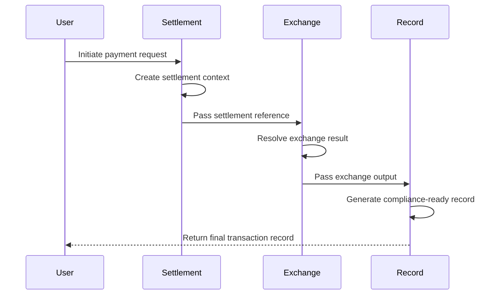

# SER Sequence Diagram

This document illustrates a simplified transaction sequence for the
SER (Settlement–Exchange–Record) coupling model.

In this reference flow, a digital payment event is treated as a coupled
transaction lifecycle in which settlement, exchange, and record generation
are linked under a common transaction identifier (TxID).

## Sequence Overview

##Description

The reference lifecycle is structured as follows:

1.	Settlement (S)
A payment request is initiated and a settlement context is created.

2.	Exchange (E)
The settled asset context is used to resolve an exchange result,
including the exchange rate and resulting output asset amount.

3.	Record (R)
A transaction record is generated using the settlement and exchange
outputs, including data relevant to traceability, audit, and
compliance-oriented record generation.

TxID Coupling

All stages are linked under a common transaction identifier (TxID).

This allows the transaction lifecycle to be treated as one coupled state
rather than as unrelated events.

Notes　

This diagram is a conceptual reference.

It is provided for research and explanatory purposes.

It does not represent production infrastructure or a mandatory implementation.
